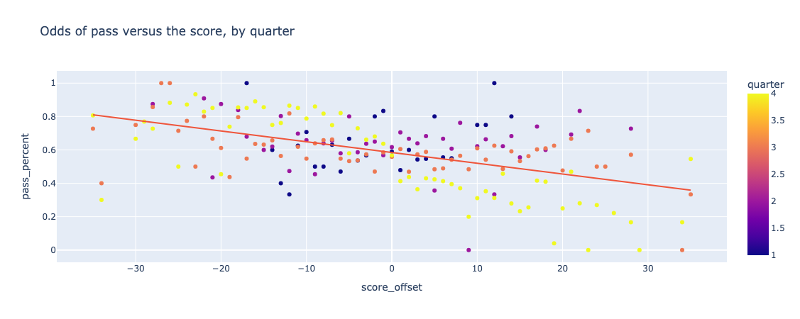

# Capstone Project
# Predicting Plays within NFL Data Bowl 2025, Final Report

David Stange


# Executive Summary
American football in the 21st century, is an era defined by prolific offensive play callers. These coaches (both head and assistant) have been able to use data, defensive tendencies, and advanced game play theory to gain advantages over their defensive counterparts. They use position groupings, down and distance, and pre-snap motion to force defenses to tip their hand for what they have planned on each play. Likewise, defensive coaches, are looking for any advantage they can gain to determine what type of play the offense has called - run or pass. 

## Problem Statement
This project attempts to predict, using game and pre-snap information, whether the offense will run or pass the ball on a given play. This is the primary objective for any defensive playcaller and knowing this information will provide valuable information when determining what groupings and formation of players the defense should be in. As each non-special teams play has only two outcomes, this naturally lends itself to binary classification. As runs generally involve less risks than passes and lead to less game clock stoppages, they are the natural choice for any team that wants to end the half or game as quickly and efficiently as possible. Likewise, as passes provide a higher probability of scoring and provide more opportunities for game clock stoppage, they are the preferred choice for teams that are losing and need to score as quickly as possible. 

## Challenges
The challenges with attempting to predict in-game behavior are:
* player differences - each team has natural strengths and weaknesses depending on the players on the team, overall roster construction, and player availability due to injury. Some teams feature players that are more skilled at runs (offensive line and running backs) while others may have players more suited to passes (quarterback and wide receivers). Each player is not created equal - replacing a dominant player with a lesser skilled player due to injury or suspension will alter what plays and formations the team will call.
* coaching differences - each coaching staff also has strengths and weaknesses depending on the systems of plays that they run, how well they mesh with the players on the team, and how effective they are at calling those plays. A coach that prefers to run the ball will call more plays than average, depending on game conditions. Also, a less skilled coaching staff might be more predictable with their play calls than a more skilled or data aware coaching staff.
* chess matches - as defenses have gotten better at scouting offensive tendencies, offenses have worked harder to go against those tendencies. Using personnel that favor runs and passes equally and calling the opposite type of a play out of a formation (i.e. running out of a passing formation and vice versa) are two ways that offenses can counter defensive research. Also, calls later in the game are totally dependent on every play that happened previously. Throwing a pass in a situation where a team had previously run the ball are all attempts at keeping the defense in the dark as to their tendencies.
* offensive and defensive matchups - the players and strengths of the defense will factor into what types of plays the offense will call. When facing a defense that is weaker against the run, for instance, offenses will tend to run more running plays. 
* game conditions - field makeup (grass versus turf) and game time weather conditions also factor in. Grass is naturally slower than turf fields and naturally degrades during the game and the season. A fast team playing on fast conditions might prefer to pass more than run to take advantage of their speed differences. Game time weather conditions may include extreme heat, cold, rain, fog, or snow which may force offenses to favor runs over passes. In 2008 a game with extreme winds caused one team to run 86% of the time due to the inherit difficulty in throwing accurately. 

Each of the above challenges were not accounted for in the dataset used in this project. 

## Summary of American Football and the National Football League
>American football, referred to simply as football in the United States and Canada and also known as gridiron football, is a team sport played by two teams of eleven players on a rectangular field with goalposts at each end. The offense, the team with possession of the oval-shaped football, attempts to advance down the field by running with the ball or throwing it, while the defense, the team without possession of the ball, aims to stop the offense's advance and to take control of the ball for themselves. The offense must advance the ball at least ten yards in four downs or plays; if they fail, they turn over the football to the defense, but if they succeed, they are given a new set of four downs to continue the drive. Points are scored primarily by advancing the ball into the opposing team's end zone for a touchdown or kicking the ball through the opponent's goalposts for a field goal. The team with the most points at the end of the game wins. In the case of a tie after four quarters, the game enters overtime. 

>A football game is played between two teams of 11 players each. Playing with more on the field is punishable by a penalty. Teams may substitute any number of their players between downs. The role of the offensive unit is to advance the football down the field with the ultimate goal of scoring a touchdown. The offensive team must line up in a legal formation before they can snap the ball - the formations are named and consist of groupings of players by position, which are groupings of players based on their ability to run, catch, tackle, throw, and move other players. 
per [Wikipedia](https://en.wikipedia.org/wiki/American_football)

The National Football League consists of 32 teams based in American cities; during the season each team will play at most one game against another team with one team playing in their home stadium and the other team designated as away. While there is a rotating bye week throughout the season, most weeks during the season consist of 16 games. 

# DataSet Details
The data comes from the National Football League and their cloud partner, AWS. The data comes from the [NFL Big Data Bowl 2025](https://www.kaggle.com/competitions/nfl-big-data-bowl-2025) dataset for every NFL game during the first nine weeks of the 2020 NFL season. The following datasets are available:

## Game Data
This data provides summary information for each game in the dataset. It includes the following fields
| Field | Type | Description | 
| ----- | ---- | ----------- | 
| gameId | numeric | Game identifier, unique | 
| season | numeric | Season of game | 
| week | numeric | Week of game | 
| homeTeamAbbr | text | Home team three-letter code | 
| visitorTeamAbbr | text | Visiting team three-letter code | 

## Play Data
This data provides summary information on each play, for every game in the dataset. It includes 50 features, for brevity, I'm only including the fields that were used during analysis.
| Field | Type | Description | 
| ----- | ---- | ----------- | 
| gameId | numeric | Game identifier, unique |
| playId | numeric | Play identifier, not unique across games |
| quarter | numeric | Game quarter |
| down | numeric | Down |
| yardsToGo | numeric | Distance needed for a first down |
| possessionTeam | text | Team abbr of team on offense with possession of ball |
| gameClock | text | Time on clock of play (MM:SS) |
| preSnapHomeScore | numeric | Home score prior to the play |
| preSnapVisitorScore | numeric | Visiting team score prior to the play |
| preSnapHomeTeamWinProbability | numeric | The win probability of the home team before the play |
| preSnapVisitorTeamWinProbability | numeric | The win probability of the visiting team before the play | 
| offenseFormation | text | Formation used by possession team |
| receiverAlignment | text | Enumerated as 0x0, 1x0, 1x1, 2x0, 2x1, 2x2, 3x0, 3x1, 3x2 |
| qbSpike | boolean | Boolean indicating whether the play was a QB Spike |
| qbKneel | numeric | Whether or not the play was a QB Kneel |
| qbSneak | numeric| Whether or not the play was a QB Sneak |
| isDropback | boolean | Boolean indicating whether the QB dropped back, meaning the play resulted in a pass, sack, or scramble |

## Understanding the Data
The data provided can be grouped into three categories:
* game conditions - this includes when and where the game is played.
* play setting - what information can be gleaned immediately from the end of the previous play. This includes how much time is remaining in the quarter/game, where the ball is on the field, what down and how many yards to go, and the score of the game. This also includes advanced metrics such as the win probability for both offense and defense - this metric is based on how often other teams have fared, historically, when faced with similar conditions. Both teams start with a 50% win percentage while a team with a large lead towards the end of the game will have a win percentage approaching 1. 
* play formation - what information can be gleaned from the offense prior to the snap. This includes what formation is the offense in and what the player groupings are. Offenses must have _at least_ five linemen and the remaining six players are a mixture of a quarterback (QB), running backs (RB), wide receivers (WR), tight ends (TE), and lineman (OL). Additional TEs and OL typically indicates a higher likelihood of a run play while additional WRs will typically indicate the opposite. Offensive formations include `EMPTY` (no players in the backfield), `SHOTGUN` (QB is aligned 5 yards behind the line), `PISTOL` (QB is aligned 2.5 yards behind the line), `SINGLEBACK` (one player in the backfield), `I_FORM` (two players in the backfield), `JUMBO` (additional OL), `WILDCAT` (player other than QB receiving the snap). Receiver alignment indicates how many of each skill position (RB, WR, and TE) are in each formation. 

## Running the Notebook
Prior to running the notebook, the following dataset will need to be downloaded from Kaggle: [Big Data Bowl 2025 dataset](https://www.kaggle.com/competitions/nfl-big-data-bowl-2025/data) and extracted to the following folder structure
```
├─data
│ └┬──big_data_bowl_2025
│  └──────<data-files>
└─predict_plays
  └───predict.ipynb
```

The notebook has two modes, which can be set in the topmost section (Hyperparameters):
* Hyperparameter Tuning - this allows you to tune parameters. Set `IS_TRAINING_MODE = False`. The final cell (in Summary) prints out the parameters determined during this run. 
* Model Training - this allows you to run models based on tuning parameters. Set `IS_TRAINING_MODE = True`. This will print out summary information which can be copied and pasted into [the change log](changelog.md).  

# Exploratory Data Analysis
 - what did I observe when researching the data
 - what approach changes did I need to make
 - insights into the data, make 1-3 of these with data to back things up
    - teams pass more in last two minutes of the game
    - when leading by 1+ score teams tend to run more or pass more
 - what baseline did I use, how do I measure accuracy
 - what do false positives and false negatives indicate

# Data Preparation
 - what changes did I need to make
 - what data did I exclude
 - What techniques did you use to ensure your data was free of missing values, and inconsistencies?
 - How did you split the data into training and test sets?
 - Please include any necessary analysis and encoding steps you took as well.
 
# Outcome
 - What types of models did
you consider for your problem (classification, regression, unsupervised)? 
Articulate the evaluation metrics you used and how you determined which model
was most optimal for your problem.
 - list which model did the best and how well it performed
 - list each model, along with ROC curve, confusion matrix, and how it performed in each category
 - can we come up with an approach that is the 

# notebook cleanup
 - try ExiBoost
 - cleanup ALL ERRORS
 - disable ALL WARNINGS
 - do final runthrough

# Next Steps areas for future analysis
 - what areas would I consider in the future
 - what are different datasets that I would incorporate
 - how would I handle team differences

# Exploratory Data Analysis
Talk about
Initial EDA has been done over the past several months. During this time, I've cleaned the data (removing plays which can't realistically be attributed to run vs pass classification), added a number of additional columns (score offset, dummies, etc), and joined data from other sources (which team is home versus away). I've also done some initial analysis - this plot shows how the odds of pass or run is affected by the quarter and the score offset. 


## Methodology
This is a binary classification problem. To solve this, I will be using scaling, iterative hyperparameter tuning, a number of classification models (logistic regression, K-Nearest Neighbors, Decision Tree, Support Vector Machines) as well as ensemble techniques (random forest and gradient boosting). 

## Results
The baseline model achieved a baseline accuracy score of 60%. The current best model (using GradientBoostingClassifier with 32 classifiers) is able to achieve an accuracy score of 74.7% (an increase of 24.5%).

Training results can be seen in the [Change Log](changelog.md)

#### Next steps
The upper limit, given the training features that I'm currently using, seems to be around 75%. I originally used dummy fields for the offensive team (1 of 32 values) but ran into compute limits. Further exploration should include the offensive team, defensive team and other game conditions (weather, etc). 

#### Outline of project

The following notebooks are in use
- [predict.ipynb](predict.ipynb)


##### Contact and Further Information