# Capstone Project
# Predicting Plays within NFL Data Bowl 2025, Final Report

David Stange


# Executive Summary
American football in the 21st century, is an era defined by prolific offensive play callers. These coaches (both head and assistant) have been able to use data, defensive tendencies, and advanced game play theory to gain advantages over their defensive counterparts. They use position groupings, down and distance, and pre-snap motion to force defenses to tip their hand for what they have planned on each play. Likewise, defensive coaches, are looking for any advantage they can gain to determine what type of play the offense has called - run or pass. 

## Problem Statement
This project attempts to predict, using game and pre-snap information, whether the offense will run or pass the ball on a given play. This is the primary objective for any defensive playcaller and knowing this information will provide valuable information when determining what groupings and formation of players the defense should be in. As each non-special teams play has only two outcomes, this naturally lends itself to binary classification. As runs generally involve less risks than passes and lead to less game clock stoppages, they are the natural choice for any team that wants to end the half or game as quickly and efficiently as possible. Likewise, as passes provide a higher probability of scoring and provide more opportunities for game clock stoppage, they are the preferred choice for teams that are losing and need to score as quickly as possible. 

## Challenges
The challenges with attempting to predict in-game behavior are:
* player differences - each team has natural strengths and weaknesses depending on the players on the team, overall roster construction, and player availability due to injury. Some teams feature players that are more skilled at runs (offensive line and running backs) while others may have players more suited to passes (quarterback and wide receivers). Each player is not created equal - replacing a dominant player with a lesser skilled player due to injury or suspension will alter what plays and formations the team will call.
* coaching differences - each coaching staff also has strengths and weaknesses depending on the systems of plays that they run, how well they mesh with the players on the team, and how effective they are at calling those plays. A coach that prefers to run the ball will call more plays than average, depending on game conditions. Also, a less skilled coaching staff might be more predictable with their play calls than a more skilled or data aware coaching staff.
* chess matches - as defenses have gotten better at scouting offensive tendencies, offenses have worked harder to go against those tendencies. Using personnel that favor runs and passes equally and calling the opposite type of a play out of a formation (i.e. running out of a passing formation and vice versa) are two ways that offenses can counter defensive research. Also, calls later in the game are totally dependent on every play that happened previously. Throwing a pass in a situation where a team had previously run the ball are all attempts at keeping the defense in the dark as to their tendencies.
* offensive and defensive matchups - the players and strengths of the defense will factor into what types of plays the offense will call. When facing a defense that is weaker against the run, for instance, offenses will tend to run more running plays. 
* game conditions - field makeup (grass versus turf) and game time weather conditions also factor in. Grass is naturally slower than turf fields and naturally degrades during the game and the season. A fast team playing on fast conditions might prefer to pass more than run to take advantage of their speed differences. Game time weather conditions may include extreme heat, cold, rain, fog, or snow which may force offenses to favor runs over passes. In 2008 a game with extreme winds caused one team to run 86% of the time due to the inherit difficulty in throwing accurately. 

Each of the above challenges were not accounted for in the dataset used in this project. 

## Summary of American Football and the National Football League
>American football, referred to simply as football in the United States and Canada and also known as gridiron football, is a team sport played by two teams of eleven players on a rectangular field with goalposts at each end. The offense, the team with possession of the oval-shaped football, attempts to advance down the field by running with the ball or throwing it, while the defense, the team without possession of the ball, aims to stop the offense's advance and to take control of the ball for themselves. The offense must advance the ball at least ten yards in four downs or plays; if they fail, they turn over the football to the defense, but if they succeed, they are given a new set of four downs to continue the drive. Points are scored primarily by advancing the ball into the opposing team's end zone for a touchdown or kicking the ball through the opponent's goalposts for a field goal. The team with the most points at the end of the game wins. In the case of a tie after four quarters, the game enters overtime. 

>A football game is played between two teams of 11 players each. Playing with more on the field is punishable by a penalty. Teams may substitute any number of their players between downs. The role of the offensive unit is to advance the football down the field with the ultimate goal of scoring a touchdown. The offensive team must line up in a legal formation before they can snap the ball - the formations are named and consist of groupings of players by position, which are groupings of players based on their ability to run, catch, tackle, throw, and move other players. 
per [Wikipedia](https://en.wikipedia.org/wiki/American_football)

The National Football League consists of 32 teams based in American cities; during the season each team will play at most one game against another team with one team playing in their home stadium and the other team designated as away. While there is a rotating bye week throughout the season, most weeks during the season consist of 16 games. 

# DataSet Details
The data comes from the National Football League and their cloud partner, AWS. The data comes from the [NFL Big Data Bowl 2025](https://www.kaggle.com/competitions/nfl-big-data-bowl-2025) dataset for every NFL game during the first nine weeks of the 2020 NFL season. The plays dataset consists of 15,000 rows. The following datasets are available:

## Game Data
This data provides summary information for each game in the dataset. It includes the following fields
| Field | Type | Description | 
| ----- | ---- | ----------- | 
| gameId | numeric | Game identifier, unique | 
| season | numeric | Season of game | 
| week | numeric | Week of game | 
| homeTeamAbbr | text | Home team three-letter code | 
| visitorTeamAbbr | text | Visiting team three-letter code | 

## Play Data
This data provides summary information on each play, for every game in the dataset. It includes 50 features, for brevity, I'm only including the fields that were used during analysis.
| Field | Type | Description | 
| ----- | ---- | ----------- | 
| gameId | numeric | Game identifier, unique |
| playId | numeric | Play identifier, not unique across games |
| quarter | numeric | Game quarter |
| down | numeric | Down |
| yardsToGo | numeric | Distance needed for a first down |
| possessionTeam | text | Team abbr of team on offense with possession of ball |
| gameClock | text | Time on clock of play (MM:SS) |
| preSnapHomeScore | numeric | Home score prior to the play |
| preSnapVisitorScore | numeric | Visiting team score prior to the play |
| preSnapHomeTeamWinProbability | numeric | The win probability of the home team before the play |
| preSnapVisitorTeamWinProbability | numeric | The win probability of the visiting team before the play | 
| offenseFormation | text | Formation used by possession team |
| receiverAlignment | text | Enumerated as 0x0, 1x0, 1x1, 2x0, 2x1, 2x2, 3x0, 3x1, 3x2 |
| qbSpike | boolean | Boolean indicating whether the play was a QB Spike |
| qbKneel | numeric | Whether or not the play was a QB Kneel |
| qbSneak | numeric| Whether or not the play was a QB Sneak |
| isDropback | boolean | Boolean indicating whether the QB dropped back, meaning the play resulted in a pass, sack, or scramble |

## Understanding the Data
The data provided can be grouped into three categories:
* game conditions - this includes when and where the game is played.
* play setting - what information can be gleaned immediately from the end of the previous play. This includes how much time is remaining in the quarter/game, where the ball is on the field, what down and how many yards to go, and the score of the game. This also includes advanced metrics such as the win probability for both offense and defense - this metric is based on how often other teams have fared, historically, when faced with similar conditions. Both teams start with a 50% win percentage while a team with a large lead towards the end of the game will have a win percentage approaching 1. 
* play formation - what information can be gleaned from the offense prior to the snap. This includes what formation is the offense in and what the player groupings are. Offenses must have _at least_ five linemen and the remaining six players are a mixture of a quarterback (QB), running backs (RB), wide receivers (WR), tight ends (TE), and lineman (OL). Additional TEs and OL typically indicates a higher likelihood of a run play while additional WRs will typically indicate the opposite. Offensive formations include `EMPTY` (no players in the backfield), `SHOTGUN` (QB is aligned 5 yards behind the line), `PISTOL` (QB is aligned 2.5 yards behind the line), `SINGLEBACK` (one player in the backfield), `I_FORM` (two players in the backfield), `JUMBO` (additional OL), `WILDCAT` (player other than QB receiving the snap). Receiver alignment indicates how many of each skill position (RB, WR, and TE) are in each formation. 

## Running the Notebook
The git repo has all of the data needed to run the notebook. The following file structure is expected (but can be overridden in hyperparameters section)
```
predict_plays
├──predict.ipynb
└──data
   └──<data-files>
```
The full dataset can be downloaded from Kaggle: [Big Data Bowl 2025 dataset](https://www.kaggle.com/competitions/nfl-big-data-bowl-2025/data)


The notebook has two modes, which can be set in the topmost section (Hyperparameters):
* Hyperparameter Tuning - this allows you to tune parameters. Set `IS_TRAINING_MODE = False`. The final cell (in Summary) prints out the parameters determined during this run. 
* Model Training - this allows you to run models based on tuning parameters. Set `IS_TRAINING_MODE = True`. This will print out summary information which can be copied and pasted into [the change log](changelog.md).  

# Exploratory Data Analysis

## Data Preparation

To ensure that the data was free of missing values, I queried each of the features for invalid numeric, boolean, or textual fields. For any fields which had NaN or unknown values, I interrogated those fields for any data patterns which I could overcome. While most of the data did not require filtering, there were some changes that needed to be made:
- *Formations*: Formation data was consistent, with the exception of QB spikes, kneels, and sneeks. In these plays, the formation is of secondary concern (for instance, any valid formation for a QB spike is ok). In cases where the formation could not be determined `UNKNOWN` was substituted. For `JUMBO` formations, the number of skill lineman could not be determined so I simply set a boolean to indicate this (`extra_ol`). 

The following features needed to be created:
- Position Features - These indicate the number of each position based on the `offenseFormation` and `receiverAlignment`, including `wr_count`, `te_count`, `rb_count`, and `extra_ol`.
- Time Features - This indicate the number of seconds remaining in the game (`secs_remaining`), is it inside of the last two minutes of the half or overtime (`is_inside_two_mins`), and whether the game is in overtime (`is_overtime`).
- Play Result Feature - This expanded on `isDropback` which didn't account for QB sneaks, kneels, and spikes. The feature `play_result` was added with these accounting as runs, runs, and passes respectively. 
- Offensive Features - The original dataset referenced everything as home or away team; getting at the score differential (`score_offset`) and win probability (`win_probability`) required joining against the games data file.

The following encodings were needed:
- *Formation* - one hot encoding was used for each formation.
- *Quarter* - while the quarter is numerical, it needed to be treated categoricall, not a numerical one (the fourth quarter is not double the second quarter). One hot encoding was used here as well as a boolean to indicate overtime. 
- *Down* - similar to quarter, down needed to be treated as a categorical feature and one-hot encoding was used. 
- *Offensive Team* - one hot encoding was used here as well, however, this did not prove to be a useful field and was discarded to keep model training performance levels acceptable. 

## Observations

When I started this project, there were several expectations that I expected the data to easily support. 

## Expectation #1: Teams pass substantially more in the last two minutes of each half
These plots show how the odds of a pass is affected by the last two minutes of each half.

*What I expected to see* - That the rate of passes will spike in the last three minutes of each half consistently across both halves.

*What I actually observed* - The rate of passes spikes in the 29th (72.6%) and 30th minute (84.2%). The variance in the data in the second half was higher but the percentage of passes in the 59th and 60th minutes weren't substantially elevated (56.5% and 64.5%). I would attribute this to teams evenly trying to get one last score before the end of the first half; in the second half the focus is more on winning the game (rather than just scoring points) so the choices here are more inline with the overall average.

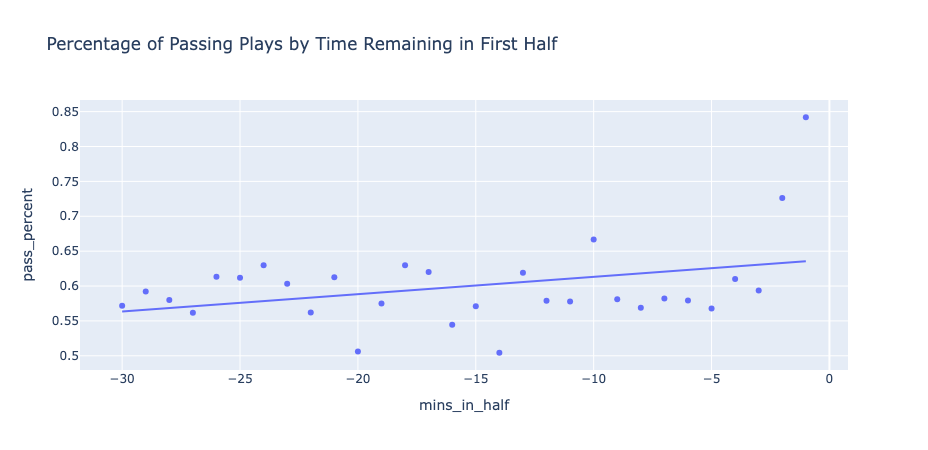<br/>
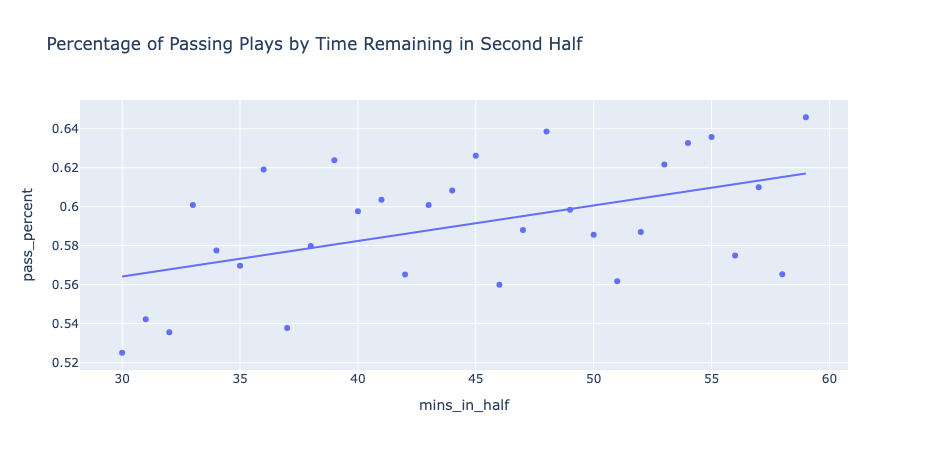<br/>

## Expectation #2: Teams pass more based on how much they are winning or losing
These plots show how the odds of a pass or a run is affected by the score offset and the quarter. 

*What I expected to see* - The more that a team is losing by will have a direct correlation to how much the pass; similarly with teams holding a lead and running the ball.  

*What I actually observed* - This becomes more and more pronounced as the game goes on. In the first quarter, when teams were losing by 2 scores (14+ points) they ran at a much _higher_ rate than the overall average (60%). Over time, however, the trend line gradually decreased. 

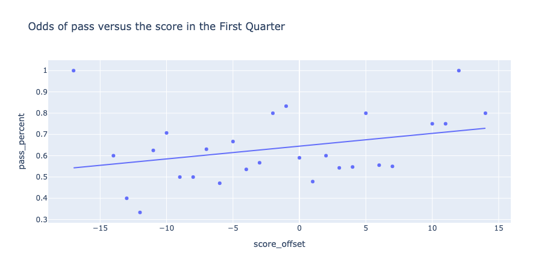<br/>
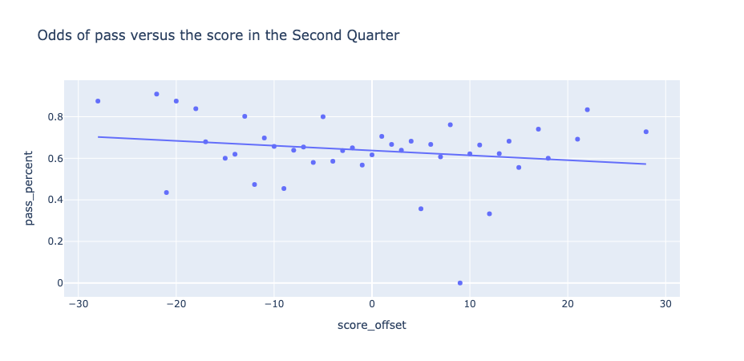<br/>
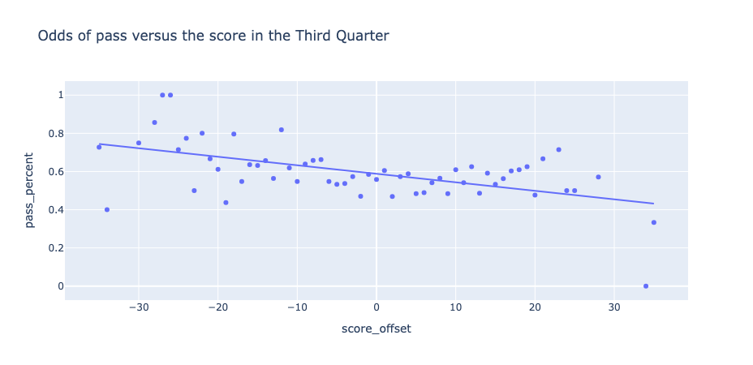<br/>
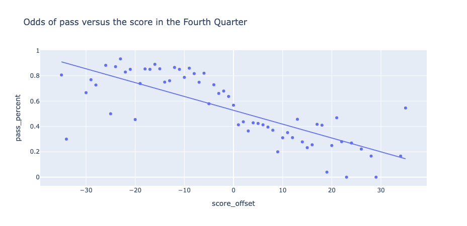

## Measuring Accuracy
For baseline I chose `DummyClassifier`, which uses the mean for the dataset (60.38%), and chose `accuracy` to guage to effectiveness of my models. 

With a false positive, defenses will be expecting a pass when it's actually a run. This means that they will generally have smaller, faster players on the field (defensive backs and coverage linebackers). This will give the offense a greater chance for a successful play (one that nets them a first down) without substantially increasing the risk of an explosive play (one that is 20+ yards). 

With a false negative, defenses will be expecting a run when it's actually a pass. This means that they will generally have larger, slower players on the field (more defensive lineman and linebackers in place of defensive backs). This will give the offense a greater chance for a successful play AND increase the risk of an explosive play. 

For defensive coaches, who are generally risk adverse, false negatives come at a much higher risk than false positives. Letting your opponent slowly move the ball down the field is _greatly preferred_ to letting them get explosive plays and long scoring plays.

## Training Data
For training data, I choose a 15/85 split (15% training data, 85% test data). The data was shuffled and stratified based on the training features with a constant random state chosen. 
 
# Outcome

## Overall Goal
The goal of this project was to predict the outcome of an individual play (run versus pass). Seven different supervised models were evaluated by their accuracy. The mean of the dataset is 60% passes, the initial expectation was that our model could improve upon the baseline by at least 120% (70% accuracy being our goal). 

The models were chosen for their ability to successfully predict outcomes in binary classification with a data set of 15k records. Deep neural networks were not chosen due to the relatively modest amount of data available. 

## Findings
The algorithm with the best accuracy LogisticRegression (0.7437) followed by GradientBoostingClassifier, DecisionTreeClassifier, and K-Nearest Neighbors all being differentiated by no more than 1%. The algorithm with the best precision is GradientBoostingClassifier (0.6854) with LogisticRegression, K-Nearest Neighbors, and DecisionTreeClassifier coming in within 1.2%. 

The following table shows each model with the best accuracy. 

| Model | Features | Train Time | Train Accuracy | Test Accuracy |
| ----- | -------- | ---------- | -------------  | -----------   |
| Dummy | 0 | 0.01 secs | 0.6038 | 0.6038 |
| LogisticRegression (fit_intercept = True, penalty = l1, C = 1.0, class_weight = balanced, solver = liblinear) | 61 | 0.01 secs | 0.7428 | 0.7420 |
| K-Nearest Neighbors (algorithm = auto, n_neighbors = 10, weights = None) | 61 | 0.10 secs | 0.7395 | 0.7415 |
| DecisionTreeClassifier with (criterion=entropy, max_depth=6, max_features=None) | 61 | 0.01 secs | 0.7403 | 0.7422 |
| SVM (default params) | 61 | 0.02 secs | 0.7713 | 0.7275 |
| RandomForestClassifier with (n_estimators=3, max_features=8) | 61 | 0.02 secs | 0.9429 | 0.6886 |
| GradientBoostingClassifier with (n_estimators=32) | 61 | 0.08 secs | 0.7589 | 0.7446 |
| XGBClassifier (n_estimators=18, max_depth=1, learning_rate=1) | 61 | 0.01 secs | 0.7386 | 0.7424 |

We were able to achieve a 23% increase over our baseline of 60.38% which exceeded our expectations. However, while the accuracy of the models was an improvement over the baseline, it's still below what is typically expected of a model. To further validate these models, we're going to run them through a series of real world scenarios and compare their accuracy against a baseline value (the highest likelihood of either a run or a pass occuring). This will determine how accurate our model is compared with random chance. We will consider anything below the baseline to be underperforming while anything above the baseline is outperforming. Anything that is 15% higher than the baseline will be considered "significantly outperforming". The best performing model (GradientBoostingClassifier) wasn't able to outperform every scenario leading to the conclusion that an ensemble approach would yield the best accuracy for all scenarios. 

Here are the ten real world scenarios that each model was validated against:
- Scenario 1) pistol formation: This formation is fairly balanced. Teams pass the ball 65% of the time.
- Scenario 2) wildcat formation: The offense is using a "run dominant" formation. Teams are run the ball 85% of the time.
- Scenario 3) shotgun formation: The offense is using a "pass dominant" formation. Teams pass the ball 75% of the time.
- Scenario 4) one score game: The team is leading or trailing by 8 pts or less. Teams pass 59% of the time (near the overall average).
- Scenario 5) 1st and 10: This is the default starting position for offenses. Teams pass 50% of the time.
- Scenario 6) 3rd and long: 3rd down and 8 or more to go. Teams pass 92% of the time.
- Scenario 7) losing by 2 scores: The team is losing by 14 points or more. Teams pass 61% of the time.
- Scenario 8) winning by 2 scores: The team is winning by 14 points or more. Teams pass 54% of the time.
- Scenario 9) 3rd and medium (3-8): Its 3rd down and 3 to 8 yards to go. Teams pass 68% of the time. 
- Scenario 10) trailing in the 4Q, 4th and 5 or less: Teams run the ball 60% of the time.

## Logistic Regression
With hyperparameters, fit_intercept = True, penalty = l2, C = 1.0, class_weight = None, solver = newton-cholesky, it achieved an accuracy of 74.4% and a precision of 0.6870 in 0.0142 secs.

Real world scenarios:
- Scenario 1) pistol formation: predicted 0.65 (actual 0.65), outperformed by 0.2
- Scenario 2) wildcat formation: predicted 0.85 (actual 0.85), outperformed by 0.1
- Scenario 3) shotgun formation: predicted 0.75 (actual 0.75), outperformed by 0.1
- Scenario 4) one score game: predicted 0.73 (actual 0.59), outperformed by 14.0
- Scenario 5) 1st and 10: predicted 0.68 (actual 0.50), outperformed by 17.8
- Scenario 6) 3rd and long: predicted 0.94 (actual 0.92), outperformed by 2.0
- Scenario 7) losing by 2 scores: predicted 0.74 (actual 0.61), outperformed by 13.1
- Scenario 8) winning by 2 scores: predicted 0.76 (actual 0.54), outperformed by 22.2
- Scenario 9) 3rd and medium (3-8): predicted 0.77 (actual 0.68), outperformed by 9.0
- Scenario 10) trailing in the 4Q, 4th and 5 or less: predicted 0.86 (actual 0.60), outperformed by 25.7

This model was able to outperform the baseline in every scenario. It significantly outperformed in three scenarios (5, 8, and 10).


## K-Nearest Neighbors
With hyperparameters, algorithm = auto, n_neighbors = 10, weights = None, it achieved an accuracy of 74% and a precision of 0.6853 in 0.18 secs.

Real world scenarios:
- Scenario 1) pistol formation: predicted 0.65 (actual 0.65), outperformed by 0.2
- Scenario 2) wildcat formation: predicted 0.85 (actual 0.85), outperformed by 0.1
- Scenario 3) shotgun formation: predicted 0.75 (actual 0.75), outperformed by 0.0
- Scenario 4) one score game: predicted 0.73 (actual 0.59), outperformed by 13.8
- Scenario 5) 1st and 10: predicted 0.68 (actual 0.50), outperformed by 17.9
- Scenario 6) 3rd and long: predicted 0.94 (actual 0.92), outperformed by 2.0
- Scenario 7) losing by 2 scores: predicted 0.74 (actual 0.61), outperformed by 13.0
- Scenario 8) winning by 2 scores: predicted 0.76 (actual 0.54), outperformed by 23.0
- Scenario 9) 3rd and medium (3-8): predicted 0.77 (actual 0.68), outperformed by 9.0
- Scenario 10) trailing in the 4Q, 4th and 5 or less: predicted 0.79 (actual 0.60), outperformed by 18.6

This model was able to outperform the baseline in every scenario. It significantly outperformed in three scenarios (5, 8, and 10).

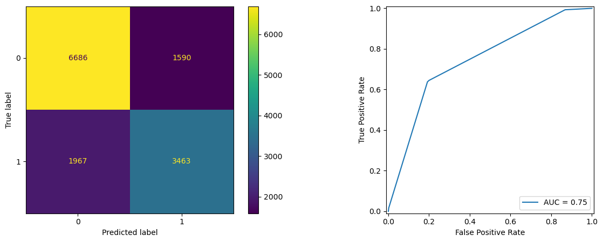

## Decision Tree
With hyperparameters, criterion=entropy, max_depth=6, max_features=None, it achieved an accuracy of 74.3% and a precision of 0.6843 in 0.01 secs.

Real world scenarios:
- Scenario 1) pistol formation: predicted 0.65 (actual 0.65), outperformed by 0.2
- Scenario 2) wildcat formation: predicted 0.69 (actual 0.85), underperformed by 16.1
- Scenario 3) shotgun formation: predicted 0.75 (actual 0.75), outperformed by 0.0
- Scenario 4) one score game: predicted 0.73 (actual 0.59), outperformed by 13.9
- Scenario 5) 1st and 10: predicted 0.68 (actual 0.50), outperformed by 18.1
- Scenario 6) 3rd and long: predicted 0.94 (actual 0.92), outperformed by 2.0
- Scenario 7) losing by 2 scores: predicted 0.74 (actual 0.61), outperformed by 13.1
- Scenario 8) winning by 2 scores: predicted 0.76 (actual 0.54), outperformed by 22.7
- Scenario 9) 3rd and medium (3-8): predicted 0.77 (actual 0.68), outperformed by 9.0
- Scenario 10) trailing in the 4Q, 4th and 5 or less: predicted 0.86 (actual 0.60), outperformed by 25.7

In the real world scenarios, it underperformed in only one scenario - the predominantly run formation. It significantly outperformed in three scenarios (5, 8, and 10)


## Support Vector Machines
With default parameters, it achieved an accuracy of 73% and a precision of 0.6523 in 0.03 secs.

Real world scenarios:
- Scenario 1) pistol formation: predicted 0.68 (actual 0.65), outperformed by 3.3
- Scenario 2) wildcat formation: predicted 0.86 (actual 0.85), outperformed by 1.4
- Scenario 3) shotgun formation: predicted 0.73 (actual 0.75), underperformed by 1.9
- Scenario 4) one score game: predicted 0.71 (actual 0.59), outperformed by 12.0
- Scenario 5) 1st and 10: predicted 0.68 (actual 0.50), outperformed by 17.2
- Scenario 6) 3rd and long: predicted 0.93 (actual 0.92), outperformed by 0.5
- Scenario 7) losing by 2 scores: predicted 0.73 (actual 0.61), outperformed by 11.6
- Scenario 8) winning by 2 scores: predicted 0.78 (actual 0.54), outperformed by 24.9
- Scenario 9) 3rd and medium (3-8): predicted 0.75 (actual 0.68), outperformed by 7.2
- Scenario 10) trailing in the 4Q, 4th and 5 or less: predicted 0.93 (actual 0.60), outperformed by 32.9

In the real world scenarios, it underperformed in only one scenario - the predominantly run formation. It significantly outperformed in three scenarios (5, 8, and 10)


## Random Forest
With hyperparameters, n_estimators=3, max_features=6, it achieved an accuracy of 68.7% and a precision of 0.5997 in 0.04 secs.

Real world scenarios:
- Scenario 1) pistol formation: predicted 0.58 (actual 0.65), underperformed by 6.6
- Scenario 2) wildcat formation: predicted 0.55 (actual 0.85), underperformed by 29.7
- Scenario 3) shotgun formation: predicted 0.69 (actual 0.75), underperformed by 5.2
- Scenario 4) one score game: predicted 0.67 (actual 0.59), outperformed by 8.1
- Scenario 5) 1st and 10: predicted 0.62 (actual 0.50), outperformed by 11.4
- Scenario 6) 3rd and long: predicted 0.92 (actual 0.92), underperformed by 0.7
- Scenario 7) losing by 2 scores: predicted 0.68 (actual 0.61), outperformed by 7.1
- Scenario 8) winning by 2 scores: predicted 0.69 (actual 0.54), outperformed by 15.9
- Scenario 9) 3rd and medium (3-8): predicted 0.71 (actual 0.68), outperformed by 3.5
- Scenario 10) trailing in the 4Q, 4th and 5 or less: predicted 0.57 (actual 0.60), underperformed by 2.9

In the real world scenarios, it underperformed in five scenarios - formation based, 3rd and long, and trailing in the fourth quarter. It significantly outperformed in only one scenarios (8 )

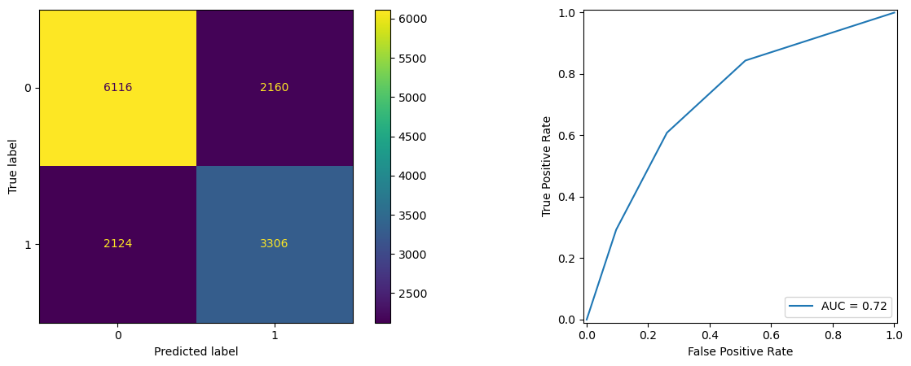


Here is the number of trees plotted with the OOB (out of bag) score.

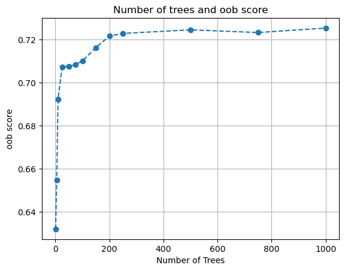

## Gradient Boosting Ensemble
With hyperparameters, n_estimators=42, it achieved an accuracy of 74.6% and a precision of 0.6854 in 0.09 secs.

Real world scenarios:
- Scenario 1) pistol formation: predicted 0.71 (actual 0.65), outperformed by 5.9
- Scenario 2) wildcat formation: predicted 0.78 (actual 0.85), underperformed by 6.7
- Scenario 3) shotgun formation: predicted 0.75 (actual 0.75), outperformed by 0.7
- Scenario 4) one score game: predicted 0.73 (actual 0.59), outperformed by 13.9
- Scenario 5) 1st and 10: predicted 0.69 (actual 0.50), outperformed by 18.1
- Scenario 6) 3rd and long: predicted 0.95 (actual 0.92), outperformed by 2.5
- Scenario 7) losing by 2 scores: predicted 0.74 (actual 0.61), outperformed by 13.4
- Scenario 8) winning by 2 scores: predicted 0.79 (actual 0.54), outperformed by 25.1
- Scenario 9) 3rd and medium (3-8): predicted 0.77 (actual 0.68), outperformed by 9.3
- Scenario 10) trailing in the 4Q, 4th and 5 or less: predicted 0.86 (actual 0.60), outperformed by 25.7

In the real world scenarios, it underperformed in only one scenario - wildcat formation. It significantly outperformed in three scenarios (5, 8, and 10)


The following shows how the score is affected by the number of boosters; here the score peaks at 42.
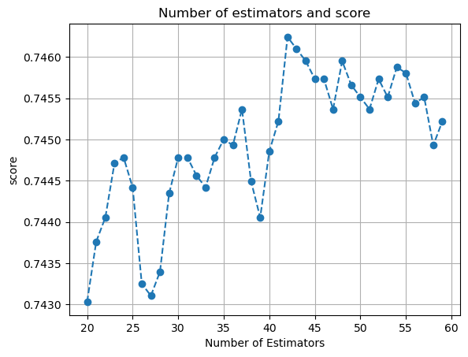

## Extreme Gradient Boosting
With hyperparameters, n_estimators=18, max_depth=1, learning_rate=1, it achieved an accuracy of 74.2% and a precision of 0.6923 in 0.02 secs.

Real world scenarios:

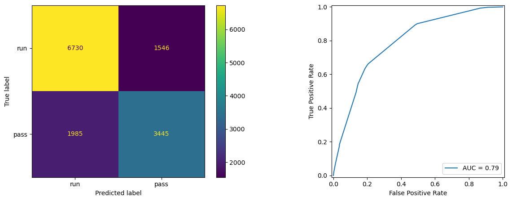

## Next Steps
There are a number of areas that should be considered to improve this model. More emphasis should be placed on the team conditions - consider the personel availability, recent game results, recent play calling, performance, injuries, etc. What system does the team run, what do they emphasize, how frequently do they run or pass in certain situations. The field conditions should be take into account as well. This should also take into account what the team has run previously in the game (previous 3rd and long, etc). It should also consider the opposing defense - what systems are they using, what are their strengths and weakenesses, where are they substituting due to injury, etc. This model could dive deeper as well and try to predict what _type_ of play the offense will run. Will they run a dropback, play action, screen, quick pass, etc. If they are running, what side are they running to and what run concept are they running. What types of motion are they using - are they using motion to show the defenses hand or are they using motion to create confusion. Any deeper dive here really needs to be training tenanted models, looking at how each team performs. Generating a general model isn't very useful in the context of an individual game. It doesn't matter what 31 other teams would do - all that matters is what the current opponent would do in a given scenario. 
